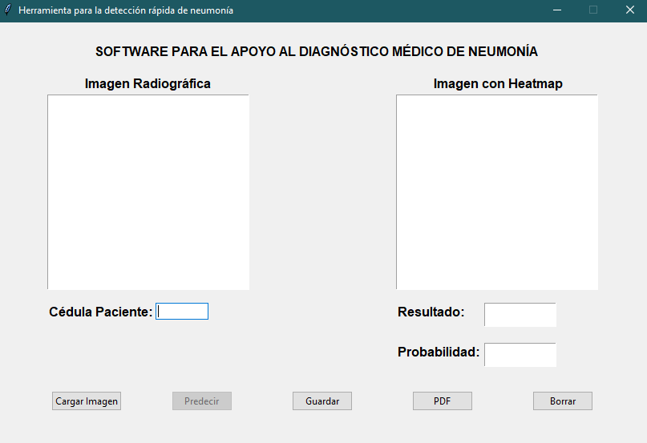
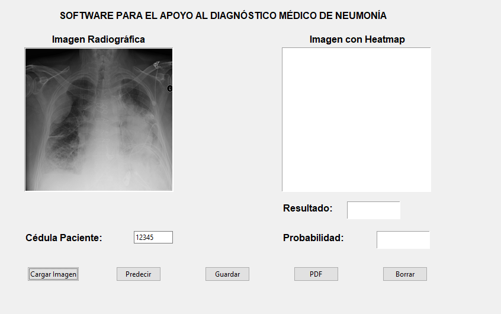
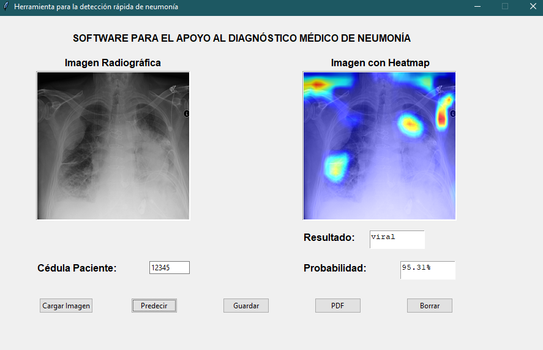

# Herramienta para la detección rápida de neumonía

En este repositorio se presenta el desarrollo y creación de una herramienta diseñada para la detección rápida de neumonía mediante el uso de Deep Learning en el procesamiento de imágenes radiográficas de tórax. El objetivo es clasificar las imágenes en tres categorías diferentes:

1. Neumonía bacteriana

2. Neumonía viral

3. Sin neumonía

Además, se implementa la técnica Grad-CAM, que permite resaltar las regiones relevantes de la imagen de entrada mediante un mapa de calor.

El repositorio incluye diversos scripts para cada una de las funciones de la herramienta, así como el módulo de integración. También se detallan los requisitos necesarios para su funcionamiento óptimo, las instrucciones de instalación, las pruebas unitarias realizadas para garantizar su correcto desempeño y la licencia correspondiente.

# Tabla de contenido
- [Introducción](#introducción)
    - [Neumonía](#neumonía)
- [Archivos del repositorio](#archivos-del-repositorio)
    - [detector_neumonia.py](#detector-neumonia-py)
    - [read_img.py](#read-img-py) 
    - [preprocess_img.py](#preprocess-img-py)
    - [load_model.py](#load-model-py)  
    - [grad_cam.py](#grad-cam-py)  
    - [integrator.py](#integrator-py)       
 - [Requerimientos para usar la herramienta de detección](#requerimientos-para-usar-la-herramienta-de-detección)
 - [Integrantes del proyecto](#Integrantes-del-proyecto)

---

# Introducción

 ## Neumonía
La neumonía es una infección que provoca la inflamación de los sacos aéreos de uno o ambos pulmones. Estos sacos pueden llenarse de líquido o pus, lo que genera síntomas como tos con flema, fiebre, escalofríos y dificultad para respirar. La neumonía puede variar en gravedad, desde una infección leve hasta una condición potencialmente mortal.

Existen diversos gérmenes que pueden causar neumonía, siendo los más comunes las bacterias, los virus respiratorios y los hongos.

El tratamiento de la neumonía varía según el tipo de paciente y la gravedad de la infección. Sin embargo, en la mayoría de los casos se utilizan antibióticos, medicamentos y antigripales para su manejo.

Para el diagnóstico médico de la neumonía, se realizan varios exámenes, como análisis de sangre, pulsioximetría, prueba de esputo y radiografía torácica. Esta última se destaca porque es la que permite al médico diagnosticar la neumonía, determinando tanto la extensión como la ubicación de la infección.

Es por esta razón que, mediante la implementación de técnicas de Deep Learning, se puede desarrollar una herramienta para la detección rápida de neumonía. Esta herramienta resalta las regiones relevantes de las imágenes, identificando áreas donde la infección podría estar presente.

**Referencias**

[1]https://www.mayoclinic.org/es/diseases-conditions/pneumonia/symptoms-causes/syc-20354204
[2]https://www.mayoclinic.org/es/diseases-conditions/pneumonia/diagnosis-treatment/drc-20354210

# Archivos del repositorio

## detector_neumonia.py

Este script contiene el diseño de la interfaz gráfica de la herramienta de detección, la cual fue desarrollada utilizando la biblioteca Tkinter. Tkinter permite crear un entorno gráfico en lugar de depender de la terminal de texto.

A través de los botones de la interfaz, se pueden invocar los diferentes métodos definidos en otros scripts, facilitando la interacción del usuario con la herramienta y mejorando la experiencia de uso.

## read_img.py

Este script permite leer un archivo de imagen en formatos como .dcm (DICOM) y otros formatos de imagen comunes (JPEG, PNG, etc.), y devuelve la representación de la imagen en formato RGB junto con un objeto de tipo Pillow (PIL)Image.

Pillow (PIL) es una biblioteca de Python que se utiliza para manipular y procesar imágenes de manera eficiente. En este caso, el script se usa específicamente para trabajar con imágenes de radiografías torácicas.

## preprocess_img.py

Una vez obtenida la representación de la imagen y el objeto Pillow (PIL) del script read_img.py, este script realiza las siguientes modificaciones para preparar la imagen para su procesamiento en el modelo de predicción:

- Redimensiona la imagen a un tamaño óptimo para su posterior uso en el modelo de predicción (512x512).

- Convierte la imagen a escala de grises.

- Implementa CLAHE (Contrast Limited Adaptive Histogram Equalization), que esuna técnica muy usada en radiología, la cual permite identificar la diferencia de intensidad entre estructuras por medio de la mejora del contraste.

- Realiza una normalización de los valores del píxel de la imagen entre 0 y 1.

- Se hace una expansión de la imagen para que tenga la forma (1,512,512,1) para el procesamiento en la red convolucional.

## load_model.py

Este script permite cargar el archivo binario del modelo denominado 'conv_MLP_84.h5', el cual es una red neuronal convolucional (CNN) basada en la arquitectura propuesta por F. Pasa, V. Golkov, F. Pfeifer, D. Cremers y D. Pfeifer en su artículo Efficient Deep Network Architectures for Fast Chest X-Ray Tuberculosis Screening and Visualization.

El modelo está formado por 5 bloques convolucionales, cada uno con 3 capas de convolución. Dos de estas capas son secuenciales, y una capa de conexión 'skip' que  se incluye para mitigar el desvanecimiento del gradiente a medida que la red avanza en profundidad.

Los bloques contienen los filtros de 16, 32, 48, 64 y 80 de tamaño 3x3

Después de cada bloque convolucional se aplica una capa de max pooling para reducir la dimensionalidad y extraer características importantes y se utiliza una capa de average pooling para consolidar aún más las características aprendidas.

El modelo incluye 3 capas Densas de 1024, 1024 y 3 neuronas (para las 3 clases de clasificación: Neumonía bacteriana, neumonía viral, sin neumonía).

Para regularizar el modelo se utiliza 3 capas de Dropout al 20%; dos en los bloques 4 y 5 conv y otra después de la 1ra capa Dense.

## grad_cam.py

Este script permite generar un mapa de calor utilizando la técnica Grad-CAM para la imagen seleccionada, lo que facilita la visualización de las áreas relevantes para la predicción realizada por el modelo.

Primero, se realiza una predicción sobre la imagen procesada utilizando el modelo previamente cargado, con el objetivo de obtener la probabilidad asociada a cada clase. A continuación, se calcula el gradiente con respecto a la salida de la última capa convolucional. El método Grad-CAM visualiza cómo varía la salida del modelo cuando se altera la activación de cada píxel en la última capa convolucional.

La función devuelve una imagen con el mapa de calor superpuesto, destacando las áreas más influyentes en la predicción. Este mapa de calor facilita la interpretación de las decisiones del modelo, permitiendo identificar las regiones de la imagen que contribuyen más significativamente a la clasificación final.

## integrator.py

Este módulo, como su nombre indica, se encarga de integrar los diferentes scripts necesarios para obtener la información que alimenta y permite el funcionamiento del entorno gráfico. A través de este proceso, se obtiene tanto la clase predicha como la probabilidad asociada al modelo, así como la imagen con el mapa de calor Grad-CAM, el cual resalta las áreas más relevantes de la imagen para la toma de decisiones del modelo

# Requerimientos para usar la herramienta de detección

Para ejecutar correctamente la herramienta de detección de neumonía, siga los siguientes pasos:

1. Se debe clonar la información del repositorio uao-neumonia  el cual se encuentra en el siguiente enlace  https://github.com/halejosm/uao-neumonia.git 
2. Instale anaconda en su sistema operativo, las instrucciones se encuentran en el siguiente link: https://docs.anaconda.com/anaconda/install/
3. Abra Anaconda Prompt y ejecute el  comando conda create -n tf tensorflow para crear un entorno virtual llamado tf con TensorFlow. Nota: La versión de Python instalada en el entorno será 3.10.13
4. Active el entorno creado con el comando conda actívate tf
5. Navegue hasta la carpeta del repositorio clonado,asegúrese de ubicar el archivo requirements.txt, que contiene las versiones de las librerías necesarias e instale las dependencias con pip install –r requirements.txt

# Uso de la interfaz gráfica

Al ejecutar el script detector_neumonia.py, se abrirá una ventana con la interfaz gráfica, la cual debe verse de la siguiente manera:

Siga los siguientes pasos

1. Escriba la cédula del paciente en la casilla correspondiente.
2. Haga clic en el botón "Cargar Imagen" y seleccione la radiografía de tórax desde su ordenador. La imagen puede estar en formato .dcm (DICOM) u otros formatos comunes como JPEG, PNG, etc.Una vez cargada la imagen, debería verla en la parte izquierda de la interfaz tal como se ve a continuación

3. Haga clic en el botón "Predecir" para ejecutar el modelo y obtener el resultado.Tras la predicción, verá lo siguiente:

- Imagen de la radiografía en la parte izquierda de la pantalla.
- Imagen con el mapa de calor en la parte derecha, destacando las áreas más influyentes en la predicción.
- El resultado predicho por el modelo (bacteriana, viral, o neumonía).
- El valor de probabilidad en porcentaje con el que el modelo determinó la clasificación.

4. Si lo desea, puede guardar los datos obtenidos haciendo clic en el botón "Guardar". Esto generará un archivo llamado "historial.csv" con los resultados.
5. Puede guardar una copia del reporte visual generado por el entorno haciendo clic en el botón "PDF". Esto creará un archivo en formato PDF y JPG con la captura de la interfaz y los resultados de la predicción.
6. Si necesita realizar una corrección o una nueva predicción, puede borrar todos los datos ingresados haciendo clic en el botón "Borrar".

# Integrantes del proyecto

- Francisco Javier Rivera Rozo
- Carlos Armando Daza Rendón
- Andrés Felipe Coral
- alejandro sanchez

   

